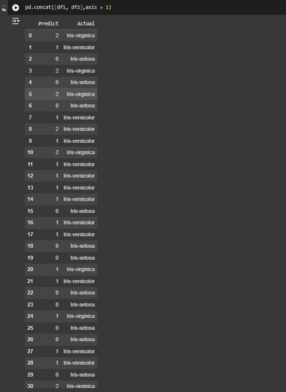
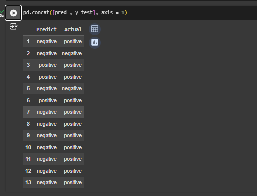
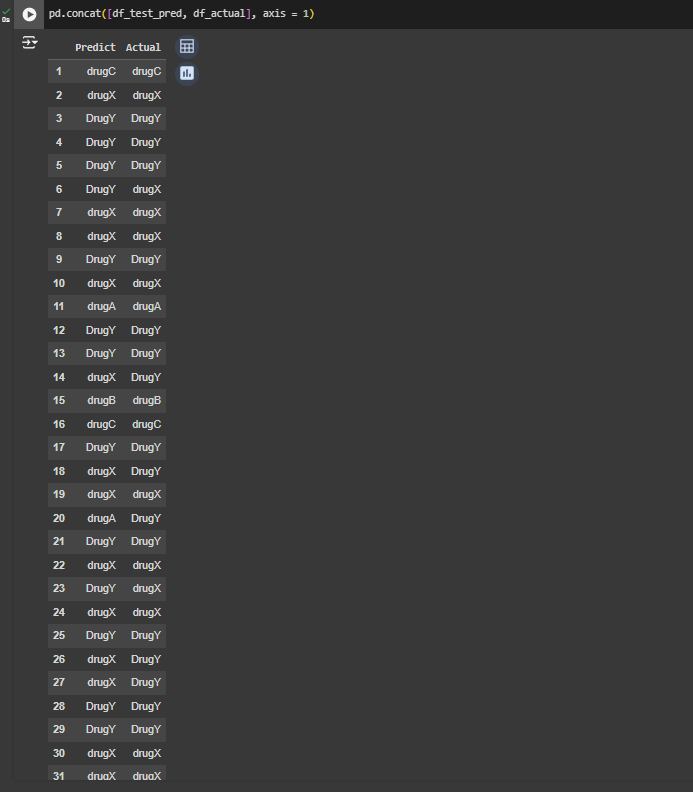

<h1>ML_Lab_3</h1>

## 1. Công nghệ sử dụng:

 - Framework: pandas, sckit-learn, Flask, pickle

## 2. Thuật toán:

 - Centroid KNN (K Nearest Neighbors)

## 3. Hiển thị kết quả lên website:

## 4. Kết quả của 3 bài tập lab 3:

 - Centroid:

 - Bài tâp 1:

 - Bài tập 2:

